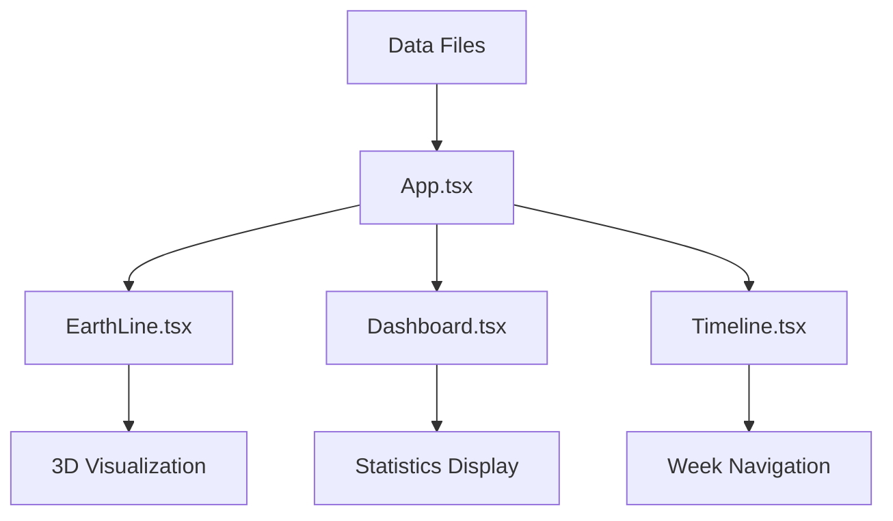

# Earth Visualization Project - Purchase Order (PO) Analytics Platform - Comprehensive Documentation

## 📋 Table of Contents
1. [Project Overview](#project-overview)
2. [Technology Stack](#technology-stack)
3. [Architecture & Design](#architecture--design)
4. [Project Structure](#project-structure)
5. [Core Components](#core-components)
6. [Data Structure & APIs](#data-structure--apis)
7. [Features & Functionality](#features--functionality)
8. [Setup & Installation](#setup--installation)
9. [Development Guide](#development-guide)
10. [Configuration](#configuration)
11. [Performance & Optimization](#performance--optimization)
12. [Troubleshooting](#troubleshooting)
13. [API Reference](#api-reference)
14. [Deployment Guide](#deployment-guide)
15. [Advanced Configuration](#advanced-configuration)

---

## 🌍 Project Overview

The **Earth Visualization Project** is an interactive 3D globe application designed to showcase company's weekly Purchase Order (PO) data in a visually stunning and intuitive format. This system provides a cost-centric visualization of departure ports, destination ports, and comprehensive statistical analytics, transforming complex business data into an engaging 3D Earth interface.

### Key Features
- **3D Interactive Globe**: Real-time rotating Earth with day/night cycle for immersive data exploration
- **PO Route Visualization**: Dynamic arcs displaying purchase order flows between departure and destination ports
- **Cost-Centric Analytics**: Interactive port labels showing cost breakdowns and PO count data for each location
- **Weekly Dashboard**: Real-time statistics dashboard with pie charts, metrics, and cost analysis
- **Timeline Navigation**: Week-by-week PO data exploration and trend analysis
- **Responsive UI**: Collapsible dashboard with smooth animations for optimal user experience

### Use Cases
- Weekly Purchase Order (PO) monitoring and analysis
- Cost-centric port performance visualization
- Departure and destination port analytics
- Supply chain cost optimization
- Business intelligence dashboards for procurement teams
- Executive reporting and data presentation

---

## 🛠 Technology Stack

### Core Technologies
| Technology | Version | Purpose |
|------------|---------|---------|
| **React** | ^18.2.0 | UI Framework |
| **TypeScript** | ~5.8.3 | Type-safe development |
| **Three.js** | ^0.176.0 | 3D graphics and WebGL |
| **Globe.gl** | ^2.41.4 | 3D globe rendering library |
| **D3.js** | ^7.9.0 | Data visualization and charts |
| **Styled Components** | ^6.1.18 | CSS-in-JS styling |
| **Vite** | ^6.3.5 | Build tool and dev server |

### Supporting Libraries
- **Lodash** (^4.17.21) - Utility functions
- **index-array-by** (^1.4.2) - Array indexing utilities
- **d3-scale** & **d3-scale-chromatic** - Color scales and palettes

### Development Tools
- **TypeScript Types** for React, Three.js, D3, Styled Components
- **Vite** for fast development and hot module replacement
- **ES Modules** for modern JavaScript standards

---

## 🏗 Architecture & Design

### Application Architecture

```
┌─────────────────────────────────────────────────────────────┐
│                        App.tsx                              │
│  ┌─────────────────────┬─────────────────────┬─────────────┐ │
│  │    EarthLine.tsx    │   Dashboard.tsx     │ Timeline.tsx│ │
│  │  (3D Globe Core)    │  (Statistics)       │ (Navigation)│ │
│  └─────────────────────┴─────────────────────┴─────────────┘ │
└─────────────────────────────────────────────────────────────┘
```

### Component Hierarchy

```
App
├── EarthLine (3D Globe)
│   ├── Globe.gl Integration
│   ├── Three.js Scene
│   ├── Shader Materials
│   └── Interactive Tooltips
├── Dashboard (Analytics Panel)
│   ├── Header
│   ├── WeeklyStatsDashboard
│   │   └── PieChart (×3)
│   └── Route Statistics
├── Timeline (Navigation)
└── ControlPanel
```

### Design Principles
- **Modular Architecture**: Separated concerns with dedicated components
- **Performance-First**: Optimized 3D rendering and data processing
- **Responsive Design**: Adaptive UI with collapsible panels
- **Type Safety**: Full TypeScript integration
- **Real-time Updates**: Dynamic data binding and live updates

---

## 📁 Project Structure

```
earth/
├── public/                          # Static assets
│   ├── data/                       # JSON data files
│   │   ├── statistics.json         # Weekly KPI data
│   │   └── statistics_detail.json  # Detailed metrics
│   ├── img/                        # Earth textures and images
│   │   ├── 2k_earth_day.jpg       # Day texture
│   │   ├── 2k_earth_night.jpg     # Night texture with city lights
│   │   └── night-sky.png          # Star field background
│   └── gen_routes.js               # Route generation script
├── src/                            # Source code
│   ├── components/                 # Reusable UI components
│   │   ├── ArcTooltip.tsx         # Shipping route tooltips
│   │   ├── ArcTooltipRenderer.tsx # Tooltip rendering utility
│   │   ├── Header.tsx             # Application header
│   │   ├── PieChart.tsx           # D3.js pie chart component
│   │   ├── PortTooltip.tsx        # Port information tooltips
│   │   ├── PortTooltipRenderer.tsx# Port tooltip renderer
│   │   ├── StatisticsChart.tsx    # Bar chart component
│   │   ├── Timeline.tsx           # Week navigation timeline
│   │   └── WeeklyStatsDashboard.tsx# KPI dashboard
│   ├── config/                    # Configuration files
│   │   ├── dayNightShader.ts      # Custom GLSL shaders
│   │   └── utils.ts               # Utility functions
│   ├── App.tsx                    # Main application component
│   ├── Dashboard.tsx              # Statistics dashboard
│   ├── EarthLine.tsx              # 3D Globe component
│   ├── ControlPanel.tsx           # Controls interface
│   └── Bg.ts                      # Starfield background
├── package.json                   # Dependencies and scripts
├── index.html                     # Entry HTML file
├── vite.config.ts                 # Vite configuration
└── tsconfig.json                  # TypeScript configuration
```

---

## 🧩 Core Components

### 1. **EarthLine.tsx** - 3D Globe Engine
The heart of the application, responsible for rendering the interactive 3D Earth.

**Key Features:**
- **Three.js Integration**: Custom shader materials for day/night cycles
- **Globe.gl Library**: High-performance 3D globe rendering
- **Dynamic Textures**: Real-time day/night texture blending
- **Route Rendering**: Great circle arcs between ports
- **Port Labels**: Interactive 3D labels with altitude layering
- **Auto-rotation**: Continuous globe rotation with mouse controls

**Technical Details:**
```typescript
// Shader material setup
material = new ShaderMaterial({
  uniforms: {
    dayTexture: { value: dayTexture },
    nightTexture: { value: nightTexture },
    sunDirection: { value: calculateSunDirection() },
  },
  vertexShader: dayNightShader.vertexShader,
  fragmentShader: dayNightShader.fragmentShader,
});
```

### 2. **Dashboard.tsx** - PO Analytics Panel
Real-time purchase order statistics and KPI visualization panel.

**Components:**
- **Collapsible Interface**: Smooth expand/collapse animations for space optimization
- **PO Route Statistics**: Active purchase order routes, cost analytics, PO counts per port
- **Weekly KPIs**: OTIF, On-time delivery performance, In-stock percentages
- **Cost-Centric Metrics**: Formatted displays for departure/destination port costs

### 3. **WeeklyStatsDashboard.tsx** - PO Performance Visualizations
Displays weekly purchase order performance indicators using interactive pie charts.

**Features:**
- **Three Key Pie Charts**: OTIF (On Time In Full), On-time Delivery rates, In-stock levels
- **PO Data Integration**: JSON-driven weekly purchase order statistics
- **Week Selection**: Dynamic data updates based on timeline

### 4. **PieChart.tsx** - D3.js Charts
Reusable donut chart component for KPI visualization.

**Technical Implementation:**
```typescript
// D3.js pie chart generation
const pie = d3.pie<typeof pieData[0]>()
  .value(d => d.value)
  .sort(null)
  .startAngle(-Math.PI / 2); // Start at top

const arc = d3.arc<d3.PieArcDatum<typeof pieData[0]>>()
  .innerRadius(radius * 0.6) // Creates donut chart
  .outerRadius(radius);
```

### 5. **Timeline.tsx** - Navigation Component
Week-by-week navigation interface for temporal data exploration.

**Features:**
- **Progress Visualization**: Linear timeline with progress indicator
- **Interactive Dots**: Clickable week markers
- **Navigation Buttons**: Previous/Next week controls
- **Week Formatting**: Display format conversion (e.g., "202517" → "2025W17")

---

## 📊 Data Structure & APIs

### Purchase Order Data Sources

#### 1. **PO Route Data** (Dynamic)
```typescript
interface RouteData {
  fromPort: string;      // Departure port name
  toPort: string;        // Destination port name
  poCount: number;       // Purchase order count for this route
  cost: number;          // Total cost for POs on this route
  wmweek: string;        // Week identifier (YYYYWW)
}
```

#### 2. **Port Data** (Dynamic)
```typescript
interface PortData {
  name: string;          // Port name
  lat: number;           // Latitude
  lng: number;           // Longitude
  idc?: string;          // Alternative identifier
}
```

#### 3. **Statistics Data** (JSON)
```json
{
  "wmweek": "202517",
  "sataistics": {
    "otif": {
      "description": "On Time In Full - A measure of delivery performance.",
      "value": 95.5,
      "unit": "%"
    },
    "ontimedelivery": {
      "description": "Percentage of orders delivered on time.",
      "value": 92.3,
      "unit": "%"
    },
    "instock": {
      "description": "Percentage of items in stock.",
      "value": 88.7,
      "unit": "%"
    }
  }
}
```

### Data Flow



### API Endpoints

| Endpoint | Purpose | Format |
|----------|---------|---------|
| `/data/from.json` | Source ports | Port array |
| `/data/to.json` | Destination ports | Port array |
| `/data/route.json` | Shipping routes | Route array |
| `/data/wmweek.json` | Week identifiers | String array |
| `/data/statistics.json` | KPI data | Statistics array |

---

## ✨ Features & Functionality

### 3D Globe Visualization

#### **Real-time Day/Night Cycle**
- **Dynamic Shader**: Custom GLSL shaders blend day and night textures
- **Sun Position**: Calculated based on real-time Beijing timezone
- **City Lights**: Night texture shows illuminated cities
- **Atmospheric Effects**: Realistic atmosphere rendering

#### **Interactive Route Visualization**
- **Great Circle Routes**: Mathematically accurate shipping paths
- **Dynamic Arcs**: Animated route lines with gradient colors
- **Altitude Calculation**: Route height based on distance
- **Collision Avoidance**: Label positioning to prevent overlaps

#### **Port Label System**
- **Layered Labels**: Multi-level altitude system for dense areas
- **Interactive Tooltips**: Rich information on hover
- **Color Coding**: Source ports (cyan) vs destination ports (orange)
- **Performance Optimization**: Filtered display based on traffic volume

### Dashboard Analytics

#### **Real-time PO Statistics**
- **Active PO Routes**: Total count of purchase order shipping routes
- **Cost-Centric Metrics**: Total and average costs for departure/destination ports
- **Purchase Order Analytics**: Weekly PO counts, cost distributions, and averages
- **Performance KPIs**: OTIF (On Time In Full), on-time delivery rates, stock levels

#### **Visual Indicators**
- **Pie Charts**: Donut-style charts for percentage KPIs (OTIF, delivery performance, stock status)
- **Cost Visualization**: Color-coded port markers based on cost data
- **Responsive Layout**: Grid-based adaptive design for optimal data presentation
- **Smooth Animations**: CSS transitions and transforms for enhanced user experience

#### **Interactive Controls**
- **Collapsible Panel**: Space-saving interface design for focused data analysis
- **Weekly Timeline Navigation**: Week-by-week PO data exploration and trend analysis
- **Real-time Updates**: Live synchronization with weekly purchase order data

### Navigation & Controls

#### **Timeline Interface**
- **Linear Progress**: Visual week progression indicator
- **Interactive Markers**: Clickable week dots
- **Keyboard Navigation**: Arrow key support
- **Week Formatting**: Human-readable date formats

#### **Globe Controls**
- **Mouse Interaction**: Drag to rotate, scroll to zoom
- **Auto-rotation**: Continuous slow rotation when idle
- **Pause on Hover**: Rotation stops during interaction
- **Smooth Transitions**: Fluid camera movements

---

## 🚀 Setup & Installation

### Prerequisites
- **Node.js** (v16.0.0 or higher)
- **npm** (v8.0.0 or higher)
- **Modern Browser** with WebGL support

### Installation Steps

1. **Clone the Repository**
   ```bash
   git clone <repository-url>
   cd earth
   ```

2. **Install Dependencies**
   ```bash
   npm install
   ```

3. **Start Development Server**
   ```bash
   npm run dev
   ```

4. **Access Application**
   ```
   http://localhost:5173
   ```

### Build for Production

```bash
# TypeScript compilation and production build
npm run build

# Preview production build
npm run preview
```

### Build Outputs
- **Development**: Hot-reload server on port 5173
- **Production**: Optimized bundle in `dist/` directory

---

## 🔧 Development Guide

### Development Workflow

1. **Local Development**
   ```bash
   npm run dev
   ```
   - Hot module replacement enabled
   - TypeScript type checking
   - Source maps for debugging

2. **Code Structure Guidelines**
   - **Components**: Functional React components with TypeScript
   - **Styling**: Styled Components for CSS-in-JS
   - **State Management**: React hooks (useState, useEffect)
   - **Type Safety**: Full TypeScript coverage

3. **Performance Optimization**
   - **Lazy Loading**: Dynamic imports for large dependencies
   - **Memoization**: React.memo for expensive components
   - **Efficient Rendering**: Throttled updates for 3D scenes

### Debugging

#### **Browser Developer Tools**
- **Console**: TypeScript source maps enabled
- **Performance**: Monitor WebGL performance
- **Network**: Track data loading times

#### **VS Code Integration**
- **Breakpoints**: Direct TypeScript debugging
- **Extensions**: TypeScript, Styled Components support
- **IntelliSense**: Full type information

### Adding New Features

#### **New Chart Types**
1. Create component in `src/components/`
2. Implement D3.js visualization
3. Add TypeScript interfaces
4. Integrate with Dashboard

#### **New Data Sources**
1. Add JSON files to `public/data/`
2. Update data loading in `App.tsx`
3. Add TypeScript interfaces
4. Pass data to components

#### **Custom Shaders**
1. Add shader files to `src/config/`
2. Update Three.js materials
3. Add uniform variables
4. Test across devices

---

## ⚙️ Configuration

### Environment Variables

```typescript
// Vite environment variables
const base = import.meta.env.BASE_URL || "/";
```

### Build Configuration

#### **vite.config.ts**
```typescript
export default defineConfig({
  plugins: [react()],
  base: '/',  // Set base path for deployment
  build: {
    outDir: 'dist',
    sourcemap: true
  }
});
```

#### **TypeScript Configuration**
```json
{
  "compilerOptions": {
    "target": "ES2020",
    "lib": ["ES2020", "DOM", "DOM.Iterable"],
    "module": "ESNext",
    "skipLibCheck": true,
    "moduleResolution": "bundler",
    "allowImportingTsExtensions": true,
    "resolveJsonModule": true,
    "isolatedModules": true,
    "noEmit": true,
    "jsx": "react-jsx",
    "strict": true
  }
}
```

### Asset Configuration

#### **Static Assets**
- **Textures**: Place in `public/img/`
- **Data Files**: Place in `public/data/`
- **Icons**: SVG format recommended

#### **Texture Requirements**
- **Day Texture**: 2K resolution Earth satellite image
- **Night Texture**: City lights overlay
- **Background**: Star field or space scene

---

## 🔍 Performance & Optimization

### 3D Rendering Optimization

#### **WebGL Performance**
- **Geometry Optimization**: Simplified meshes for better frame rates
- **Texture Compression**: Optimized image formats
- **Draw Call Reduction**: Batched rendering operations

#### **Memory Management**
- **Texture Disposal**: Cleanup unused textures
- **Geometry Disposal**: Remove unused geometries
- **Event Listener Cleanup**: Prevent memory leaks

### Data Processing Optimization

#### **Large Dataset Handling**
```typescript
// Efficient data processing with useMemo
const processedData = useMemo(() => {
  return largeDataset.map(processItem);
}, [largeDataset]);
```

#### **Lazy Loading**
```typescript
// Dynamic imports for code splitting
const HeavyComponent = lazy(() => import('./HeavyComponent'));
```

### Bundle Optimization

#### **Code Splitting**
- **Route-based**: Split by major components
- **Library-based**: Separate vendor bundles
- **Dynamic Imports**: Load on demand

#### **Asset Optimization**
- **Image Compression**: WebP format when possible
- **Tree Shaking**: Remove unused code
- **Minification**: Production build optimizations

---

## 🐛 Troubleshooting

### Common Issues

#### **WebGL Compatibility**
```typescript
// Check WebGL support
if (!canvas.getContext('webgl2')) {
  console.error('WebGL 2.0 not supported');
}
```

#### **Performance Issues**
- **Reduce Arc Resolution**: Lower `arcCurveResolution` value
- **Limit Label Count**: Filter ports by traffic volume
- **Disable Auto-rotation**: For low-end devices

#### **Data Loading Errors**
```typescript
// Error handling for data fetching
try {
  const response = await fetch('/data/routes.json');
  if (!response.ok) throw new Error('Data fetch failed');
  const data = await response.json();
} catch (error) {
  console.error('Data loading error:', error);
}
```

### Browser Compatibility

| Browser | Minimum Version | WebGL Support |
|---------|----------------|---------------|
| Chrome | 90+ | ✅ Full |
| Firefox | 88+ | ✅ Full |
| Safari | 14+ | ✅ Limited |
| Edge | 90+ | ✅ Full |

### Performance Monitoring

#### **Frame Rate Monitoring**
```typescript
// Monitor rendering performance
const stats = new Stats();
document.body.appendChild(stats.dom);

function animate() {
  stats.begin();
  // Rendering code
  stats.end();
  requestAnimationFrame(animate);
}
```

#### **Memory Usage**
```typescript
// Monitor WebGL memory
const info = renderer.info;
console.log('Geometries:', info.memory.geometries);
console.log('Textures:', info.memory.textures);
```

---

## 📚 API Reference

### Component APIs

#### **EarthLine Component**
```typescript
interface EarthLineProps {
  fromData: any[];           // Source port data
  toData: any[];            // Destination port data  
  routeData: any[];         // Shipping route data
  isDashboardCollapsed: boolean; // Dashboard state
}
```

**Usage:**
```typescript
<EarthLine 
  fromData={fromPorts}
  toData={toPorts} 
  routeData={routes}
  isDashboardCollapsed={isCollapsed}
/>
```

#### **Dashboard Component**
```typescript
interface DashboardProps {
  routeData: any[];         // Route data for statistics
  isCollapsed: boolean;     // Collapse state
  onToggleCollapse: () => void; // Toggle handler
}
```

#### **PieChart Component**
```typescript
interface PieChartProps {
  value: number;            // Percentage value (0-100)
  title: string;            // Chart title
  width?: number;           // Chart width (default: 120)
  height?: number;          // Chart height (default: 120)
  unit?: string;            // Unit display (default: '%')
}
```

#### **Timeline Component**
```typescript
interface TimelineProps {
  wmweeks: string[];        // Available weeks
  currentWmweek: string;    // Current selected week
  onWmweekChange: (week: string) => void; // Week change handler
}
```

### Utility Functions

#### **Sun Position Calculation**
```typescript
// Get current sun position based on Beijing time
function getSunPosition(): [number, number]

// Calculate 3D sun direction vector for shaders
function calculateSunDirection(): Vector3
```

#### **Data Processing**
```typescript
// Get port totals from route data
function getTotals(
  port: any, 
  fromPortTotals: any, 
  toPortTotals: any
): { totalCost: number; totalPOCount: number }
```

#### **Great Circle Calculations**
```typescript
// Calculate shortest path between two geographic points
function getGreatCirclePath(
  start: { lat: number; lng: number },
  end: { lat: number; lng: number }
): { start: Point; end: Point }

// Calculate distance between two points in radians
function greatCircleDistance(
  start: { lat: number; lng: number },
  end: { lat: number; lng: number }
): number
```

---

## 🚀 Deployment Guide

### GitHub Pages Deployment

The project includes a deployment script for GitHub Pages:

```bash
# Make the script executable
chmod +x github_pages_deploy.sh

# Deploy to GitHub Pages
./github_pages_deploy.sh
```

**Script Contents:**
```bash
#!/bin/bash
# Build the project
npm run build

# Deploy to gh-pages branch
git subtree push --prefix dist origin gh-pages
```

### Static Hosting (Nginx/Apache)

#### **Nginx Configuration**
```nginx
server {
    listen 80;
    server_name your-domain.com;
    root /path/to/dist;
    index index.html;

    # Handle SPA routing
    location / {
        try_files $uri $uri/ /index.html;
    }

    # Cache static assets
    location ~* \.(js|css|png|jpg|jpeg|gif|ico|svg)$ {
        expires 1y;
        add_header Cache-Control "public, immutable";
    }

    # Gzip compression
    gzip on;
    gzip_types text/plain text/css application/json application/javascript text/xml application/xml application/xml+rss text/javascript;
}
```

#### **Apache Configuration**
```apache
<VirtualHost *:80>
    ServerName your-domain.com
    DocumentRoot /path/to/dist
    
    # Handle SPA routing
    <Directory "/path/to/dist">
        RewriteEngine On
        RewriteBase /
        RewriteRule ^index\.html$ - [L]
        RewriteCond %{REQUEST_FILENAME} !-f
        RewriteCond %{REQUEST_FILENAME} !-d
        RewriteRule . /index.html [L]
    </Directory>
</VirtualHost>
```

### CDN Deployment

#### **AWS CloudFront**
1. Upload `dist/` contents to S3 bucket
2. Create CloudFront distribution
3. Set custom error page: `/index.html` for 404 errors
4. Enable Gzip compression

#### **Vercel Deployment**
```json
{
  "version": 2,
  "builds": [
    {
      "src": "package.json",
      "use": "@vercel/static-build",
      "config": { "distDir": "dist" }
    }
  ],
  "routes": [
    { "handle": "filesystem" },
    { "src": "/(.*)", "dest": "/index.html" }
  ]
}
```

---

## 🔧 Advanced Configuration

### Custom Shader Development

#### **Creating New Shaders**
```typescript
// Define custom shader in config/
export const customShader = {
  vertexShader: `
    varying vec2 vUv;
    void main() {
      vUv = uv;
      gl_Position = projectionMatrix * modelViewMatrix * vec4(position, 1.0);
    }
  `,
  fragmentShader: `
    uniform float time;
    varying vec2 vUv;
    void main() {
      vec3 color = vec3(sin(time + vUv.x * 10.0));
      gl_FragColor = vec4(color, 1.0);
    }
  `
};
```

#### **Applying Custom Shaders**
```typescript
// In EarthLine.tsx
const material = new ShaderMaterial({
  uniforms: {
    time: { value: 0.0 },
    customParam: { value: 1.0 }
  },
  vertexShader: customShader.vertexShader,
  fragmentShader: customShader.fragmentShader
});
```

### Data Source Customization

#### **Adding New Data Sources**
1. **Create Data File**
   ```json
   // public/data/custom-data.json
   {
     "metadata": {
       "version": "1.0",
       "lastUpdated": "2025-06-01"
     },
     "data": [
       {
         "id": "custom-001",
         "value": 123.45,
         "category": "analytics"
       }
     ]
   }
   ```

2. **Update App.tsx**
   ```typescript
   const [customData, setCustomData] = useState<any[]>([]);
   
   useEffect(() => {
     fetch('/data/custom-data.json')
       .then(res => res.json())
       .then(data => setCustomData(data));
   }, []);
   ```

3. **Create TypeScript Interface**
   ```typescript
   interface CustomDataItem {
     id: string;
     value: number;
     category: string;
   }
   ```

### Performance Tuning

#### **WebGL Optimization Settings**
```typescript
// Optimize renderer settings
const renderer = new WebGLRenderer({
  canvas: canvasElement,
  antialias: false,        // Disable for better performance
  powerPreference: "high-performance",
  stencil: false,
  depth: true
});

// Set pixel ratio for high-DPI displays
renderer.setPixelRatio(Math.min(window.devicePixelRatio, 2));
```

#### **LOD (Level of Detail) Implementation**
```typescript
// Adjust detail based on distance
const cameraDistance = camera.position.distanceTo(globeCenter);
const arcResolution = cameraDistance > 5 ? 32 : 64;

myGlobe.arcCurveResolution(arcResolution);
```

#### **Texture Optimization**
```typescript
// Compress textures for better performance
const textureLoader = new TextureLoader();
const dayTexture = textureLoader.load('/img/2k_earth_day.jpg');
dayTexture.generateMipmaps = false;
dayTexture.minFilter = LinearFilter;
dayTexture.magFilter = LinearFilter;
```

### Custom Styling

#### **Theme Configuration**
```typescript
// Define color theme
export const theme = {
  primary: '#4dd0e1',
  secondary: '#ffa500',
  background: 'rgba(15, 25, 35, 0.8)',
  text: '#ebebeb',
  success: '#00ff00',
  warning: '#ff8c00',
  error: '#ff0080'
};

// Use in styled components
const StyledComponent = styled.div`
  color: ${theme.primary};
  background: ${theme.background};
`;
```

#### **Responsive Breakpoints**
```typescript
const breakpoints = {
  mobile: '768px',
  tablet: '1024px',
  desktop: '1440px'
};

const ResponsiveComponent = styled.div`
  @media (max-width: ${breakpoints.mobile}) {
    width: 100%;
  }
  @media (min-width: ${breakpoints.tablet}) {
    width: 50%;
  }
`;
```

---

## 🧪 Testing & Quality Assurance

### Performance Testing

#### **FPS Monitoring**
```typescript
// Add FPS counter for performance monitoring
import Stats from 'stats.js';

const stats = new Stats();
stats.showPanel(0); // 0: fps, 1: ms, 2: mb
document.body.appendChild(stats.dom);

function animate() {
  stats.begin();
  // Render scene
  renderer.render(scene, camera);
  stats.end();
  requestAnimationFrame(animate);
}
```

#### **Memory Usage Monitoring**
```typescript
// Monitor WebGL memory usage
setInterval(() => {
  const info = renderer.info;
  console.log({
    geometries: info.memory.geometries,
    textures: info.memory.textures,
    calls: info.render.calls,
    triangles: info.render.triangles
  });
}, 5000);
```

### Cross-Browser Testing

#### **WebGL Feature Detection**
```typescript
function checkWebGLSupport(): boolean {
  try {
    const canvas = document.createElement('canvas');
    const gl = canvas.getContext('webgl2') || canvas.getContext('webgl');
    return !!gl;
  } catch (e) {
    return false;
  }
}

// Fallback for unsupported browsers
if (!checkWebGLSupport()) {
  // Display fallback UI or error message
  console.error('WebGL not supported');
}
```

#### **Device Performance Detection**
```typescript
function getDevicePerformance(): 'high' | 'medium' | 'low' {
  const canvas = document.createElement('canvas');
  const gl = canvas.getContext('webgl');
  
  if (!gl) return 'low';
  
  const renderer = gl.getParameter(gl.RENDERER);
  const vendor = gl.getParameter(gl.VENDOR);
  
  // Basic heuristics for performance classification
  if (renderer.includes('Intel HD')) return 'low';
  if (renderer.includes('NVIDIA') || renderer.includes('AMD')) return 'high';
  
  return 'medium';
}
```

---

## 📄 License & Credits

### Technology Credits
- **Three.js**: 3D graphics library
- **Globe.gl**: Globe rendering framework
- **D3.js**: Data visualization library
- **React**: UI framework
- **Vite**: Build tool

### Asset Credits
- **Earth Textures**: NASA Earth Observatory
- **Star Field**: Space imagery sources
- **Port Data**: Maritime industry databases

---

*This documentation provides a comprehensive guide to understanding, developing, and maintaining the Earth Visualization Project. For additional support or questions, please refer to the component-specific documentation within the source code.*
