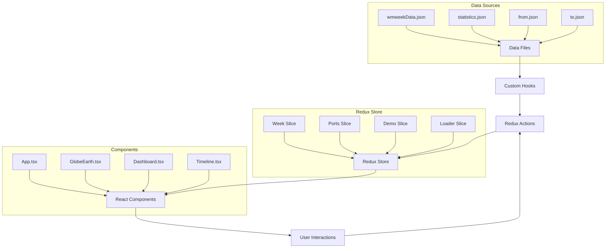

# Global Sourcing Purchase Order Dashboard - Comprehensive Documentation

## 📋 Table of Contents
1. [Project Overview](#project-overview)
2. [Technology Stack](#technology-stack)
3. [Architecture & Design](#architecture--design)
4. [Project Structure](#project-structure)
5. [Core Components](#core-components)
6. [Data Structure & APIs](#data-structure--apis)
7. [Features & Functionality](#features--functionality)
8. [Setup & Installation](#setup--installation)
9. [Configuration](#configuration)
10. [Performance & Optimization](#performance--optimization)
11. [API Reference](#api-reference)
12. [Deployment Guide](#deployment-guide)
13. [Advanced Configuration](#advanced-configuration)
14. [Authors & Contributors](#authors--contributors)

---

## 🌍 Project Overview

The **Global Sourcing Purchase Order Dashboard** is an interactive 3D globe application designed to showcase company's weekly Purchase Order (PO) data in a visually stunning and intuitive format. This system provides a cost-centric visualization of departure ports, destination ports, and comprehensive statistical analytics, transforming complex business data into an engaging 3D Earth interface.

### Project Background

This dashboard was specifically developed to serve as a **real-time visualization solution for corporate reception areas**, providing an impressive and informative display that showcases the company's global sourcing operations to visitors, clients, and stakeholders. The system transforms complex purchase order data into an easily digestible, visually striking presentation that demonstrates the company's international business scope and operational efficiency.

### Target Usage Scenarios

#### **Primary Use Case: Corporate Reception Display**
- **Large Screen Deployment**: Designed for deployment on large displays (55"+ screens) in company reception areas and lobbies
- **Real-time PO Status Visualization**: Continuously displays current purchase order activities, shipping routes, and operational metrics
- **Professional Presentation**: Creates an impressive visual representation of global business operations for visitors and clients
- **Automated Operation**: Runs autonomously with minimal intervention, automatically cycling through weekly data and updates

#### **Secondary Use Case: Daily Operations Support**
- **Operational Dashboard**: Supports daily purchase order monitoring and analysis for procurement teams
- **Performance Tracking**: Enables real-time tracking of OTIF (On Time In Full) metrics, delivery performance, and inventory status
- **Decision Support**: Provides data-driven insights for supply chain optimization and vendor performance evaluation
- **Executive Reporting**: Offers high-level overview of global sourcing activities for management review

#### **Key Business Objectives**
- **Brand Impression**: Demonstrates technological sophistication and global operational scale to visitors
- **Operational Transparency**: Provides real-time visibility into purchase order flows and performance metrics
- **Data Democratization**: Makes complex supply chain data accessible through intuitive 3D visualization
- **Continuous Monitoring**: Enables 24/7 monitoring of critical supply chain KPIs and purchase order status

### Key Features
- **3D Interactive Globe**: Real-time rotating Earth with day/night cycle for immersive data exploration
- **PO Route Visualization**: Dynamic arcs displaying purchase order flows between departure and destination ports
- **Cost-Centric Analytics**: Interactive port labels showing cost breakdowns and PO count data for each location
- **Weekly Dashboard**: Real-time statistics dashboard with pie charts, metrics, and cost analysis
- **Timeline Navigation**: Week-by-week PO data exploration and trend analysis
- **Responsive UI**: Collapsible dashboard with smooth animations for optimal user experience

### Use Cases
- Weekly Purchase Order (PO) monitoring and analysis
- Cost-centric port performance visualization
- Departure and destination port analytics
- Supply chain cost optimization
- Business intelligence dashboards for procurement teams
- Executive reporting and data presentation

---

## 🛠 Technology Stack

### Core Technologies
| Technology | Version | Purpose |
|------------|---------|---------|
| **React** | ^18.2.0 | UI Framework |
| **TypeScript** | ~5.8.3 | Type-safe development |
| **Redux Toolkit** | Latest | State management |
| **Three.js** | ^0.176.0 | 3D graphics and WebGL |
| **Globe.gl** | ^2.41.4 | 3D globe rendering library |
| **D3.js** | ^7.9.0 | Data visualization and charts |
| **Styled Components** | ^6.1.18 | CSS-in-JS styling |
| **Vite** | ^6.3.5 | Build tool and dev server |

### Supporting Libraries
- **Lodash** (^4.17.21) - Utility functions
- **index-array-by** (^1.4.2) - Array indexing utilities
- **d3-scale** & **d3-scale-chromatic** - Color scales and palettes

### Development Tools
- **TypeScript Types** for React, Three.js, D3, Styled Components
- **Vite** for fast development and hot module replacement
- **ES Modules** for modern JavaScript standards

---

## 🏗 Architecture & Design

### Application Architecture

The application follows a Redux-based state management architecture with React components for UI rendering and Three.js for 3D visualization.

```
┌─────────────────────────────────────────────────────────────────────────────┐
│                                App.tsx                                      │
│  ┌──────────────┬──────────────────┬──────────────────┬─────────────────────┐ │
│  │  TopBar.tsx  │   Dashboard.tsx  │ PortsSidebar.tsx │   GlobeEarth.tsx    │ │
│  │ (Navigation) │  (Analytics)     │ (Port Controls)  │    (3D Globe)       │ │
│  └──────────────┴──────────────────┴──────────────────┴─────────────────────┘ │
│  ┌─────────────────────────────────────────────────────────────────────────┐ │
│  │                          BottomBar.tsx                                 │ │
│  │                         (Timeline & Controls)                          │ │
│  └─────────────────────────────────────────────────────────────────────────┘ │
└─────────────────────────────────────────────────────────────────────────────┘
```

### Redux State Management

The application uses Redux Toolkit for centralized state management with four main slices:

```typescript
interface RootState {
  week: WeekState;      // Current week selection
  ports: PortsState;    // Port selection state
  loader: LoaderState;  // Data loading state
  demo: DemoState;      // Demo/tour system state
}
```

### Component Hierarchy

```arcade
App
├── TopBar (Navigation & Demo Controls)
│   ├── DropdownMenu
│   └── IconButton Components
├── Dashboard (Analytics Panel)
│   ├── WeeklyStatsDashboard
│   │   └── PieChart (×3: OTIF, OnTime, InStock)
│   ├── POStats (Purchase Order Statistics)
│   └── HistoricalCharts (Trend Analysis)
├── PortsSidebar (Port Management)
│   └── Port Selection Controls
├── GlobeEarth (3D Visualization)
│   ├── Globe.gl Integration
│   ├── Three.js Scene Management
│   ├── TourControl (Demo System)
│   │   ├── DemoInfo (Step Information)
│   │   └── RegionShowcase (Regional Tours)
│   ├── ArcTooltip (Route Information)
│   └── PortTooltip (Port Details)
└── BottomBar (Timeline Navigation)
    └── Timeline (Week Selection)
```

### Design Principles
- **Redux-First Architecture**: Centralized state management with predictable data flow
- **Modular Components**: Separated concerns with dedicated, reusable components
- **Performance-First**: Optimized 3D rendering and data processing with memoization
- **Responsive Design**: Adaptive UI with collapsible panels and responsive layouts
- **Type Safety**: Full TypeScript integration across components and state management
- **Real-time Updates**: Dynamic data binding with Redux subscriptions and live updates
- **Demo System**: Interactive tour system with scripted demonstrations and regional showcases

---

## 📁 Project Structure

```
earth/
├── public/                          # Static assets
│   ├── data/                       # JSON data files
│   │   ├── statistics.json         # Weekly KPI data
│   │   └── statistics_detail.json  # Detailed metrics
│   ├── img/                        # Earth textures and images
│   │   ├── 2k_earth_day.jpg       # Day texture
│   │   ├── 2k_earth_night.jpg     # Night texture with city lights
│   │   └── night-sky.png          # Star field background
│   ├── *.json                      # Core data files (routes, ports, statistics)
│   └── gen_routes.js               # Route generation script
├── src/                            # Source code
│   ├── components/                 # Reusable UI components
│   │   ├── bar/                   # Navigation bar components
│   │   │   ├── TopBar.tsx         # Top navigation with menu
│   │   │   ├── BottomBar.tsx      # Bottom timeline bar
│   │   │   └── Container.tsx      # Bar container styling
│   │   ├── globe/                 # 3D globe components
│   │   │   ├── Earth.tsx          # Main globe component
│   │   │   ├── type.ts            # Globe-specific types
│   │   │   ├── util.ts            # Globe utilities
│   │   │   ├── assets/            # Globe textures
│   │   │   └── settings/          # Globe configuration
│   │   ├── tour/                  # Demo and tour system
│   │   │   ├── TourControl.tsx    # Demo orchestration
│   │   │   ├── DemoInfo.tsx       # Step information display
│   │   │   ├── RegionShowcase.tsx # Regional tours
│   │   │   └── TourMessage.tsx    # Tour messaging
│   │   ├── ArcTooltip.tsx         # Shipping route tooltips
│   │   ├── ArcTooltipRenderer.tsx # Tooltip rendering utility
│   │   ├── DropdownMenu.tsx       # Navigation dropdown
│   │   ├── Header.tsx             # Application header
│   │   ├── HistoricalCharts.tsx   # Trend analysis charts
│   │   ├── Icon.tsx               # Icon component system
│   │   ├── IconButton.tsx         # Interactive icon buttons
│   │   ├── PieChart.tsx           # D3.js pie chart component
│   │   ├── PortTooltip.tsx        # Port information tooltips
│   │   ├── PortTooltipRenderer.tsx# Port tooltip renderer
│   │   ├── PortsSidebar.tsx       # Port selection sidebar
│   │   ├── POStats.tsx            # Purchase order statistics
│   │   ├── StatisticsChart.tsx    # Bar chart component
│   │   ├── Timeline.tsx           # Week navigation timeline
│   │   └── WeeklyStatsDashboard.tsx# KPI dashboard
│   ├── config/                    # Configuration files
│   │   ├── constants.ts           # Application constants
│   │   ├── dayNightShader.ts      # Custom GLSL shaders
│   │   └── utils.ts               # Utility functions
│   ├── hooks/                     # Custom React hooks
│   │   ├── loader.ts              # Data loading hooks
│   │   └── useKeyboardShortcuts.tsx# Keyboard navigation
│   ├── redux/                     # State management
│   │   ├── hook.ts                # Redux hooks (useAppSelector, useAppDispatch)
│   │   └── store.ts               # Redux store configuration
│   ├── store/                     # Additional store configuration
│   │   ├── hooks.ts               # Legacy store hooks
│   │   ├── index.ts               # Store exports
│   │   └── slices/                # Redux slices
│   │       └── dashboardSlice.ts  # Dashboard state slice
│   ├── App.tsx                    # Main application component
│   ├── Dashboard.tsx              # Statistics dashboard
│   ├── EarthLine.tsx              # Legacy 3D Globe component
│   ├── ControlPanel.tsx           # Controls interface
│   ├── main.tsx                   # Application entry point
│   ├── type.ts                    # TypeScript type definitions
│   └── style.css                  # Global styles
├── asset/                         # Additional assets
│   └── video/                     # Demo video assets
│       ├── videoscript.txt        # Demo scripts
│       └── srt/                   # Subtitle files
│           ├── *-english.srt      # English subtitles
│           └── *-chinese.srt      # Chinese subtitles
├── document/                      # Project documentation
│   ├── PROJECT_DOCUMENTATION.md   # This comprehensive guide
│   ├── COMPONENT_REFERENCE.md     # Component API reference
│   ├── DEMO_SUMMARY.md           # Demo system documentation
│   ├── DATA_FORMAT_GUIDE.md      # Data structure guide
│   └── *.md                      # Additional documentation
├── package.json                   # Dependencies and scripts
├── index.html                     # Entry HTML file
├── vite.config.ts                 # Vite configuration
└── tsconfig.json                  # TypeScript configuration
```

---

## 🧩 Core Components

### 1. **App.tsx** - Main Application Container
The root component that orchestrates the entire application, managing global state and component coordination.

**Key Features:**
- **Redux Integration**: Connects to Redux store for state management
- **Layout Management**: Handles collapsible sidebar and dashboard states
- **Demo Coordination**: Manages demo selection and regional showcases
- **Data Loading**: Initiates data loading through custom hooks
- **Port Management**: Processes and manages port data for visualization

**Technical Details:**
```typescript
const App: React.FC = () => {
  const [isDashboardCollapsed, setIsDashboardCollapsed] = useState<boolean>(false);
  const [isPortSidebarCollapsed, setIsPortSidebarCollapsed] = useState<boolean>(true);
  const [selectedDemo, setSelectedDemo] = useState<string | null>(null);
  const [selectedRegion, setSelectedRegion] = useState<RegionOption | null>(null);
  
  const loadData = useWeekDataLoader();
  const dispatch = useAppDispatch();
  // Component orchestration logic...
};
```

### 2. **GlobeEarth.tsx** - 3D Globe Visualization Engine
The core 3D visualization component powered by Three.js and Globe.gl.

**Key Features:**
- **Three.js Integration**: Custom shader materials for day/night cycles
- **Globe.gl Library**: High-performance 3D globe rendering with WebGL
- **Redux State Binding**: Real-time updates based on Redux state changes
- **Interactive Tours**: Integration with TourControl for scripted demonstrations
- **Dynamic Rendering**: Route arcs, port labels, and interactive tooltips
- **Performance Optimization**: Efficient rendering with requestAnimationFrame

**Technical Implementation:**
```typescript
// Globe integration with Redux state
const selectedPorts = useAppSelector((state) => state.ports.selectedPorts);
const currentWeek = useAppSelector((state) => state.week.currentWeek);
const isDemoActive = useAppSelector((state) => state.demo.isActive);

// Dynamic data binding for real-time updates
const filteredRoutes = useMemo(() => {
  return routeData.filter(route => selectedPorts.includes(route.fromPort));
}, [routeData, selectedPorts]);
```

### 3. **Dashboard.tsx** - Analytics and Statistics Panel
Comprehensive analytics dashboard with real-time purchase order insights.

**Components:**
- **WeeklyStatsDashboard**: KPI visualization with interactive pie charts
- **POStats**: Purchase order statistics and cost analysis
- **HistoricalCharts**: Trend analysis and historical data visualization
- **Collapsible Interface**: Space-optimized design with smooth animations

**Redux Integration:**
```typescript
const statisticsData = useAppSelector((state) => state.loader.data?.statistics ?? []);
const currentWeek = useAppSelector((state) => state.week.currentWeek);
```

### 4. **TopBar.tsx** - Navigation and Control Center
Primary navigation component with demo controls and menu system.

**Features:**
- **Demo Selection**: Dropdown menu for scripted demonstrations
- **Region Navigation**: Regional showcase selection
- **Loading States**: Visual feedback for data loading operations
- **Responsive Menu**: Collapsible navigation for different screen sizes
- **Keyboard Integration**: Support for keyboard shortcuts

### 5. **TourControl.tsx** - Demo and Tour Orchestration
Advanced demo system for guided tours and regional showcases.

**Capabilities:**
- **Scripted Demonstrations**: Pre-defined demo sequences with timing control
- **Regional Tours**: Geographic focus tours for different shipping regions
- **Step-by-Step Navigation**: Guided progression through demo content
- **Progress Tracking**: Visual progress indicators and completion status
- **Integration with Globe**: Seamless camera control and data highlighting

**Demo Scripts:**
```typescript
const DEMO_SCRIPTS: ScriptedDemo[] = [
  {
    id: 'quick-overview',
    name: 'Quick Overview',
    description: 'A 2-minute overview of global shipping routes',
    steps: [...] // Detailed step configuration
  },
  // Additional demo configurations...
];
```

### 6. **PortsSidebar.tsx** - Port Management Interface
Interactive port selection and filtering system.

**Features:**
- **Port Selection**: Multi-select interface for port filtering
- **Redux State Management**: Synchronized with global port selection state
- **Visual Feedback**: Real-time updates reflecting current selections
- **Bulk Operations**: Select all, clear all functionality

### 7. **Timeline.tsx** - Temporal Navigation
Week-by-week navigation interface for historical data exploration.

**Redux Integration:**
```typescript
const wmweeks = useAppSelector((state) => 
  (state.loader.data?.week || []).map((item) => item.wmweek)
);
const currentWmweek = useAppSelector((state) => state.week.currentWeek);
const dispatch = useAppDispatch();

const handleDotClick = (wmweek: string) => {
  dispatch(setCurrentWeek(wmweek));
};
```

---

## 📊 Data Structure & APIs

### Redux State Management

The application uses Redux Toolkit for centralized state management with four primary slices:

#### 1. **Week State Slice**
```typescript
interface WeekState {
  currentWeek: string;  // Currently selected week (YYYYWW format)
}

// Actions
const weekSlice = createSlice({
  name: "week",
  initialState: { currentWeek: "" },
  reducers: {
    setCurrentWeek: (state, action: PayloadAction<string>) => {
      state.currentWeek = action.payload;
    },
  },
});
```

#### 2. **Ports State Slice**
```typescript
interface PortsState {
  selectedPorts: string[];  // Currently selected ports for filtering
  fromPorts: string[];      // Available departure ports
  toPorts: string[];        // Available destination ports
}

// Actions: togglePort, selectAllPorts, clearSelectedPorts, setPorts
```

#### 3. **Demo State Slice**
```typescript
interface DemoState {
  isActive: boolean;        // Demo system active state
  currentDemo: string | null; // Active demo ID
  currentStep: number;      // Current step in demo sequence
  progress: number;         // Demo completion progress (0-1)
  tourMessage: string;      // Current tour message text
}

// Actions: setDemoActive, setCurrentDemo, setCurrentStep, setProgress, setTourMessage
```

#### 4. **Loader State Slice**
```typescript
interface LoaderState {
  loading?: boolean;        // Data loading state
  loaded?: boolean;         // Data loaded successfully
  error?: string;          // Error message if loading failed
  data?: {                 // Loaded application data
    from: FromPortInfo[];
    to: ToPortInfo[];
    week: WeekOrderCollection[];
    statistics: StatisticsData[];
  };
}

// Actions: loaderStart, loaderSuccess, loaderFail
```

### Data Sources and Interfaces

#### 1. **Purchase Order Route Data**
```typescript
interface RouteData {
  fromPort: string;      // Departure port name
  toPort: string;        // Destination port name
  poCount: number;       // Purchase order count for this route
  cost: number;          // Total cost for POs on this route
  wmweek: string;        // Week identifier (YYYYWW)
}
```

#### 2. **Port Information Data**
```typescript
interface PortData {
  name: string;          // Port name
  lat: number;           // Latitude coordinate
  lng: number;           // Longitude coordinate
  idc?: string;          // Alternative identifier
}
```

#### 3. **Weekly Statistics Data**
```typescript
interface StatisticsData {
  wmweek: string;        // Week identifier
  statistics: {
    otif: {
      description: string;
      value: number;
      unit: string;
    };
    ontimedelivery: {
      description: string;
      value: number;
      unit: string;
    };
    instock: {
      description: string;
      value: number;
      unit: string;
    };
  };
}
```

### Data Flow Architecture

The application follows a unidirectional data flow pattern using Redux:



### Custom Hooks Integration

#### **useWeekDataLoader Hook**
```typescript
export const useWeekDataLoader = () => {
  const dispatch = useAppDispatch();
  
  const loadData = useCallback(async () => {
    dispatch(loaderStart());
    try {
      const [fromData, toData, weekData, statisticsData] = await Promise.all([
        fetch(`${base}from.json`).then(res => res.json()),
        fetch(`${base}to.json`).then(res => res.json()),
        fetch(`${base}wmweekData.json`).then(res => res.json()),
        fetch(`${base}data/statistics.json`).then(res => res.json())
      ]);
      
      dispatch(loaderSuccess({ 
        from: fromData, 
        to: toData, 
        week: weekData, 
        statistics: statisticsData 
      }));
    } catch (error) {
      dispatch(loaderFail(error.message));
    }
  }, [dispatch]);
  
  return loadData;
};
```

### Component State Subscription Patterns

#### **Redux State Access in Components**
```typescript
// Example: Dashboard component accessing Redux state
const Dashboard: React.FC<DashboardProps> = ({ isCollapsed, onToggleCollapse }) => {
  // Subscribe to relevant Redux state slices
  const statisticsData = useAppSelector((state) => state.loader.data?.statistics ?? []);
  const currentWeek = useAppSelector((state) => state.week.currentWeek);
  
  // Dispatch actions to update state
  const dispatch = useAppDispatch();
  const handleWeekSelect = (wmweek: string) => {
    dispatch(setCurrentWeek(wmweek));
  };
  
  // Component renders based on Redux state...
};
```

```
    C --> F[3D Visualization]
    D --> G[Statistics Display]
    E --> H[Week Navigation]
```

### API Endpoints

| Endpoint | Purpose | Format |
|----------|---------|---------|
| `/data/from.json` | Source ports | Port array |
| `/data/to.json` | Destination ports | Port array |
| `/data/route.json` | Shipping routes | Route array |
| `/data/wmweek.json` | Week identifiers | String array |
| `/data/statistics.json` | KPI data | Statistics array |

---

## ✨ Features & Functionality

### 3D Globe Visualization

#### **Real-time Day/Night Cycle**
- **Dynamic Shader**: Custom GLSL shaders blend day and night textures
- **Sun Position**: Calculated based on real-time Beijing timezone
- **City Lights**: Night texture shows illuminated cities
- **Atmospheric Effects**: Realistic atmosphere rendering

#### **Interactive Route Visualization**
- **Great Circle Routes**: Mathematically accurate shipping paths
- **Dynamic Arcs**: Animated route lines with gradient colors
- **Altitude Calculation**: Route height based on distance
- **Collision Avoidance**: Label positioning to prevent overlaps

#### **Port Label System**
- **Layered Labels**: Multi-level altitude system for dense areas
- **Interactive Tooltips**: Rich information on hover
- **Color Coding**: Source ports (cyan) vs destination ports (orange)
- **Performance Optimization**: Filtered display based on traffic volume

### Dashboard Analytics

#### **Real-time PO Statistics**
- **Active PO Routes**: Total count of purchase order shipping routes
- **Cost-Centric Metrics**: Total and average costs for departure/destination ports
- **Purchase Order Analytics**: Weekly PO counts, cost distributions, and averages
- **Performance KPIs**: OTIF (On Time In Full), on-time delivery rates, stock levels

#### **Visual Indicators**
- **Pie Charts**: Donut-style charts for percentage KPIs (OTIF, delivery performance, stock status)
- **Cost Visualization**: Color-coded port markers based on cost data
- **Responsive Layout**: Grid-based adaptive design for optimal data presentation
- **Smooth Animations**: CSS transitions and transforms for enhanced user experience

#### **Interactive Controls**
- **Collapsible Panel**: Space-saving interface design for focused data analysis
- **Weekly Timeline Navigation**: Week-by-week PO data exploration and trend analysis
- **Real-time Updates**: Live synchronization with weekly purchase order data

### Navigation & Controls

#### **Timeline Interface**
- **Linear Progress**: Visual week progression indicator
- **Interactive Markers**: Clickable week dots
- **Keyboard Navigation**: Arrow key support
- **Week Formatting**: Human-readable date formats

#### **Globe Controls**
- **Mouse Interaction**: Drag to rotate, scroll to zoom
- **Auto-rotation**: Continuous slow rotation when idle
- **Pause on Hover**: Rotation stops during interaction
- **Smooth Transitions**: Fluid camera movements

### Demo and Tour System

#### **Scripted Demonstrations**
- **Quick Overview**: 2-minute overview of global shipping routes with automated camera movement
- **Detailed Analysis**: 20-second detailed analysis of specific regions and routes
- **Regional Deep Dive**: 30-second focused exploration of major shipping hubs
- **Comprehensive Demo**: 36-second complete tour showcasing all system features

#### **Interactive Tour Features**
- **Step-by-Step Navigation**: Guided progression through demo content with visual cues
- **Progress Tracking**: Real-time progress indicators and completion status
- **Tour Messaging**: Contextual information display during demonstrations
- **Keyboard Shortcuts**: Quick access controls for demo navigation (spacebar, arrow keys)

#### **Regional Showcases**
- **Asia Pacific Hub**: Focus on China, Japan, and Southeast Asian shipping routes
- **European Gateway**: Key European ports and Mediterranean trade routes
- **North American Corridor**: Major US and Canadian shipping destinations
- **Global Overview**: Worldwide shipping network visualization
- **Custom Regions**: User-defined regional focus areas with flexible viewpoints

#### **Port Management System**
- **Multi-Select Interface**: Interactive port selection with visual feedback
- **Bulk Operations**: Select all, clear all, and filtered selection options
- **Real-time Filtering**: Dynamic route visualization based on port selections
- **State Persistence**: Port selections maintained across demo sessions

> **📖 For detailed demo system documentation, including subtitle files and technical implementation details, see [DEMO_SUMMARY.md](./DEMO_SUMMARY.md)**

---

## 🚀 Setup & Installation

### Prerequisites
- **Node.js** (v16.0.0 or higher)
- **npm** (v8.0.0 or higher)
- **Modern Browser** with WebGL support

### Installation Steps

1. **Clone the Repository**
   ```bash
   git clone <repository-url>
   cd earth
   ```

2. **Install Dependencies**
   ```bash
   npm install
   ```

3. **Start Development Server**
   ```bash
   npm run dev
   ```

4. **Access Application**
   ```
   http://localhost:5173
   ```

### Build for Production

```bash
# TypeScript compilation and production build
npm run build

# Preview production build
npm run preview
```

### Build Outputs
- **Development**: Hot-reload server on port 5173
- **Production**: Optimized bundle in `dist/` directory

---


## ⚙️ Configuration

### Environment Variables

```typescript
// Vite environment variables
const base = import.meta.env.BASE_URL || "/";
```

### Build Configuration

#### **vite.config.ts**
```typescript
export default defineConfig({
  plugins: [react()],
  base: '/',  // Set base path for deployment
  build: {
    outDir: 'dist',
    sourcemap: true
  }
});
```

#### **TypeScript Configuration**
```json
{
  "compilerOptions": {
    "target": "ES2020",
    "lib": ["ES2020", "DOM", "DOM.Iterable"],
    "module": "ESNext",
    "skipLibCheck": true,
    "moduleResolution": "bundler",
    "allowImportingTsExtensions": true,
    "resolveJsonModule": true,
    "isolatedModules": true,
    "noEmit": true,
    "jsx": "react-jsx",
    "strict": true
  }
}
```

### Asset Configuration

#### **Static Assets**
- **Textures**: Place in `public/img/`
- **Data Files**: Place in `public/data/`
- **Icons**: SVG format recommended

#### **Texture Requirements**
- **Day Texture**: 2K resolution Earth satellite image
- **Night Texture**: City lights overlay
- **Background**: Star field or space scene

---

## 🔍 Performance & Optimization

### 3D Rendering Optimization

#### **WebGL Performance**
- **Geometry Optimization**: Simplified meshes for better frame rates
- **Texture Compression**: Optimized image formats
- **Draw Call Reduction**: Batched rendering operations

#### **Memory Management**
- **Texture Disposal**: Cleanup unused textures
- **Geometry Disposal**: Remove unused geometries
- **Event Listener Cleanup**: Prevent memory leaks

### Data Processing Optimization

#### **Large Dataset Handling**
```typescript
// Efficient data processing with useMemo
const processedData = useMemo(() => {
  return largeDataset.map(processItem);
}, [largeDataset]);
```

#### **Lazy Loading**
```typescript
// Dynamic imports for code splitting
const HeavyComponent = lazy(() => import('./HeavyComponent'));
```

### Bundle Optimization

#### **Code Splitting**
- **Route-based**: Split by major components
- **Library-based**: Separate vendor bundles
- **Dynamic Imports**: Load on demand

#### **Asset Optimization**
- **Image Compression**: WebP format when possible
- **Tree Shaking**: Remove unused code
- **Minification**: Production build optimizations

---

## 📚 API Reference

### Component APIs

#### **EarthLine Component**
```typescript
interface EarthLineProps {
  fromData: any[];           // Source port data
  toData: any[];            // Destination port data  
  routeData: any[];         // Shipping route data
  isDashboardCollapsed: boolean; // Dashboard state
}
```

**Usage:**
```typescript
<EarthLine 
  fromData={fromPorts}
  toData={toPorts} 
  routeData={routes}
  isDashboardCollapsed={isCollapsed}
/>
```

#### **Dashboard Component**
```typescript
interface DashboardProps {
  routeData: any[];         // Route data for statistics
  isCollapsed: boolean;     // Collapse state
  onToggleCollapse: () => void; // Toggle handler
}
```

#### **PieChart Component**
```typescript
interface PieChartProps {
  value: number;            // Percentage value (0-100)
  title: string;            // Chart title
  width?: number;           // Chart width (default: 120)
  height?: number;          // Chart height (default: 120)
  unit?: string;            // Unit display (default: '%')
}
```

#### **Timeline Component**
```typescript
interface TimelineProps {
  wmweeks: string[];        // Available weeks
  currentWmweek: string;    // Current selected week
  onWmweekChange: (week: string) => void; // Week change handler
}
```

### Utility Functions

#### **Sun Position Calculation**
```typescript
// Get current sun position based on Beijing time
function getSunPosition(): [number, number]

// Calculate 3D sun direction vector for shaders
function calculateSunDirection(): Vector3
```

#### **Data Processing**
```typescript
// Get port totals from route data
function getTotals(
  port: any, 
  fromPortTotals: any, 
  toPortTotals: any
): { totalCost: number; totalPOCount: number }
```

#### **Great Circle Calculations**
```typescript
// Calculate shortest path between two geographic points
function getGreatCirclePath(
  start: { lat: number; lng: number },
  end: { lat: number; lng: number }
): { start: Point; end: Point }

// Calculate distance between two points in radians
function greatCircleDistance(
  start: { lat: number; lng: number },
  end: { lat: number; lng: number }
): number
```

---

## 🚀 Deployment Guide

### GitHub Pages Deployment

The project includes a deployment script for GitHub Pages:

```bash
# Make the script executable
chmod +x github_pages_deploy.sh

# Deploy to GitHub Pages
./github_pages_deploy.sh
```

**Script Contents:**
```bash
#!/bin/bash
# Build the project
npm run build

# Deploy to gh-pages branch
git subtree push --prefix dist origin gh-pages
```

### Static Hosting (Nginx/Apache)

#### **Nginx Configuration**
```nginx
server {
    listen 80;
    server_name your-domain.com;
    root /path/to/dist;
    index index.html;

    # Handle SPA routing
    location / {
        try_files $uri $uri/ /index.html;
    }

    # Cache static assets
    location ~* \.(js|css|png|jpg|jpeg|gif|ico|svg)$ {
        expires 1y;
        add_header Cache-Control "public, immutable";
    }

    # Gzip compression
    gzip on;
    gzip_types text/plain text/css application/json application/javascript text/xml application/xml application/xml+rss text/javascript;
}
```

---

## 🔧 Advanced Configuration

### Data Source Customization

#### **Adding New Data Sources**
1. **Create Data File**
   ```json
   // public/data/custom-data.json
   {
     "metadata": {
       "version": "1.0",
       "lastUpdated": "2025-06-01"
     },
     "data": [
       {
         "id": "custom-001",
         "value": 123.45,
         "category": "analytics"
       }
     ]
   }
   ```

2. **Update App.tsx**
   ```typescript
   const [customData, setCustomData] = useState<any[]>([]);
   
   useEffect(() => {
     fetch('/data/custom-data.json')
       .then(res => res.json())
       .then(data => setCustomData(data));
   }, []);
   ```

3. **Create TypeScript Interface**
   ```typescript
   interface CustomDataItem {
     id: string;
     value: number;
     category: string;
   }
   ```

---

## 👥 Authors & Contributors

This project was developed by the Walmart Global Souring Technology team:

### **Development Team**
- **Ellis Tian** - [Ellis.tian@walmart.com](mailto:Ellis.tian@walmart.com)
  - Lead Developer & Project Architect
- **Fletcher Yuan** - [Fletcher.yuan@walmart.com](mailto:Fletcher.yuan@walmart.com)  
  - Frontend Developer & UI/UX Design
- **Huaiwei Zhu** - [huaiwei.zhu@walmart.com](mailto:huaiwei.zhu@walmart.com)
  - Backend Integration & Data Analytics
- **Tiantian Fan** - [tiantian.fan@walmart.com](mailto:tiantian.fan@walmart.com)
  - Frontend Developer & Data Visualization & Performance Optimization

### **Project Acknowledgments**
Special thanks to the Walmart Global Sourcing and Supply Chain teams for providing the business requirements, data specifications, and continuous feedback that made this visualization platform possible.

---

*This documentation provides a comprehensive guide to understanding, developing, and maintaining the Earth Visualization Project. For additional support or questions, please refer to the component-specific documentation within the source code.*
